# KaamKaaj Architecture

## Project Links

- **GitHub Repository:** https://github.com/shivangiS04/KaamKaaj
- **Deployed Application:** https://kaam-kaaj-blue.vercel.app/login

```mermaid
graph TB

  %% ─────────────────────────────────────────
  %% USER ROLES
  %% ─────────────────────────────────────────
  subgraph Roles["👥 Three User Roles"]
    EMP["🧑 Employee
    ─────────────────
    • Create & submit goals
    • Input Q1-Q4 achievements
    • View score analytics
    • Receive email notifications"]

    MGR["👔 Manager
    ─────────────────
    • Review submitted goals
    • Approve / Return with comment
    • Quarterly check-in comments
    • Share goals to team members
    • View team dashboard"]

    ADM["🛡️ Admin / HR
    ─────────────────
    • Manage users & roles
    • Create & activate goal cycles
    • Open/close check-in windows
    • Unlock locked goals
    • Completion dashboard
    • Achievement reports + CSV export
    • Full audit log viewer"]
  end

  %% ─────────────────────────────────────────
  %% FRONTEND
  %% ─────────────────────────────────────────
  subgraph Frontend["🖥️ Frontend — React 18 + TypeScript + Vite"]

    subgraph EmpPages["Employee Pages"]
      EP1["EmployeeDashboard
      Bar + Pie + QoQ Line Charts"]
      EP2["GoalCreation
      8 goals max · 100% weightage"]
      EP3["MyGoals
      Status tracking"]
      EP4["AchievementInput
      Q1-Q4 · Auto score compute"]
    end

    subgraph MgrPages["Manager Pages"]
      MP1["ManagerDashboard
      Team stats overview"]
      MP2["TeamGoalReview
      Approve / Return + inline edit"]
      MP3["ManagerCheckin
      Per-quarter comments"]
      MP4["ApprovedGoals
      Share goals to employees"]
    end

    subgraph AdminPages["Admin Pages"]
      AP1["AdminDashboard
      Manager effectiveness
      Escalation alerts"]
      AP2["UserManagement
      Roles · Reporting lines"]
      AP3["CycleManagement
      Q1-Q4 window toggles"]
      AP4["GoalUnlock
      Unlock locked goals"]
      AP5["CompletionDashboard
      Per-employee Q1-Q4 status"]
      AP6["AchievementReport
      Filter + CSV export"]
      AP7["AuditLogViewer
      Paginated · filterable"]
    end

    subgraph SharedUI["Shared UI Components"]
      SU1["ProtectedRoute
      Role-based guards"]
      SU2["ThemeToggle
      Dark / Light mode
      Tailwind v4 custom variant"]
      SU3["NotificationBell
      In-app notifications"]
      SU4["ShareGoalModal
      Push goals to employees"]
      SU5["PageSkeletons + Skeleton
      All pages loading states"]
    end

    subgraph Utils["Utility Layer"]
      UT1["scoreCalculator.ts
      numeric_min · numeric_max
      timeline · zero-based"]
      UT2["checkinWindow.ts
      Date-range enforcement"]
      UT3["csvExport.ts
      Achievement report export"]
      UT4["sharedGoals.ts
      Shared goal RLS helpers"]
      UT5["email.ts
      sendEmail() + resolveEmail()
      @demo.com → real inbox"]
    end

    subgraph Auth["Auth Layer"]
      AU1["AuthContext
      user · profile · session · role"]
      AU2["React Router v6
      /employee · /manager · /admin"]
    end

  end

  %% ─────────────────────────────────────────
  %% VERCEL
  %% ─────────────────────────────────────────
  subgraph Vercel["☁️ Vercel — Free Tier · ₹0/month"]
    V1["Global CDN + Edge Network"]
    V2["SPA Hosting
    vercel.json rewrites
    /api/* → serverless
    /* → index.html"]
    V3["Serverless Function
    /api/send-email
    Reads RESEND_API_KEY
    from process.env
    Never exposes key to browser"]
  end

  %% ─────────────────────────────────────────
  %% SUPABASE
  %% ─────────────────────────────────────────
  subgraph Supabase["🗄️ Supabase — Free Tier · ₹0/month · 50k MAU"]
    SB_AUTH["Supabase Auth
    JWT · Email/Password
    Auto token refresh"]

    SB_REST["Auto-generated REST API
    supabase-js client
    Type-safe queries"]

    SB_RLS["Row Level Security
    Employee → own goals only
    Manager → team goals only
    Admin → full access"]

    subgraph DB["PostgreSQL Database"]
      T1["profiles
      id · name · email · role · manager_id"]
      T2["goals
      title · thrust_area · uom_type
      target · weightage · status · is_locked"]
      T3["goal_cycles
      year · phase · window dates
      is_active · checkin_windows JSONB"]
      T4["achievements
      goal_id · quarter · actual_value
      actual_date · progress_status · score"]
      T5["checkin_comments
      achievement_id · manager_id · comment"]
      T6["audit_logs
      table · record_id · action
      old_data · new_data JSONB · changed_by"]
      T7["shared_goal_assignments
      source_goal_id · assigned_to · weightage"]
      T8["notifications
      user_id · message · metadata JSONB"]
    end
  end

  %% ─────────────────────────────────────────
  %% RESEND
  %% ─────────────────────────────────────────
  subgraph ResendAPI["📧 Resend API — Free Tier"]
    R1["Goal Submitted → Manager email"]
    R2["Goal Approved → Employee email"]
    R3["Goal Returned → Employee email
    includes manager comment"]
  end

  %% ─────────────────────────────────────────
  %% SCORE ENGINE
  %% ─────────────────────────────────────────
  subgraph ScoreEngine["🧮 Score Calculation Engine"]
    SC1["numeric_min — Higher is better
    score = actual ÷ target × 100"]
    SC2["numeric_max — Lower is better
    score = target ÷ actual × 100"]
    SC3["timeline — Date-based
    score = 100 if on time else 0"]
    SC4["zero-based
    score = 100 if actual = 0 else 0"]
  end

  %% ─────────────────────────────────────────
  %% CONNECTIONS
  %% ─────────────────────────────────────────

  EMP --> EP1 & EP2 & EP3 & EP4
  MGR --> MP1 & MP2 & MP3 & MP4
  ADM --> AP1 & AP2 & AP3 & AP4 & AP5 & AP6 & AP7

  EP1 & EP2 & EP3 & EP4 --> AU1
  MP1 & MP2 & MP3 & MP4 --> AU1
  AP1 & AP2 & AP3 & AP4 & AP5 & AP6 & AP7 --> AU1

  AU1 --> AU2
  AU2 --> SU1
  Frontend --> V1
  V1 --> V2
  V2 --> SB_AUTH
  V2 --> SB_REST
  SB_REST --> SB_RLS
  SB_RLS --> DB

  EP4 --> UT1
  UT1 --> SC1 & SC2 & SC3 & SC4

  AP3 --> T3
  T3 -->|"checkin_windows JSONB"| EP4

  UT5 --> V3
  V3 --> ResendAPI

  MP2 -->|"submit"| R1
  MP2 -->|"approve"| R2
  MP2 -->|"return"| R3

  AP6 --> UT3
  MP4 & AP6 --> SU4

  T2 --> T4
  T4 --> T5
  T2 --> T7
  T2 & T4 --> T6
```

---

## Tech Stack Summary

| Layer | Technology | Cost |
|---|---|---|
| Frontend | React 18 + TypeScript + Vite | Free |
| Styling | Tailwind CSS v4 + Lucide Icons | Free |
| Charts | Recharts (Bar · Pie · Line) | Free |
| Hosting | Vercel Free Tier | ₹0/month |
| Serverless | Vercel Functions `/api/send-email` | ₹0/month |
| Database | Supabase PostgreSQL | ₹0/month |
| Auth | Supabase Auth (JWT) | ₹0/month |
| Email | Resend Free Tier | ₹0/month |
| **Total** | **Full production stack** | **₹0/month** |

---

## Score Calculation Logic

| UoM Type | Formula | Example |
|---|---|---|
| Numeric Min (higher = better) | `(actual / target) × 100` | Target 100, Actual 120 → **100%** |
| Numeric Max (lower = better) | `(target / actual) × 100` | Target 5, Actual 3 → **100%** |
| Timeline (date-based) | `100 if on time else 0` | Before deadline → **100%** |
| Zero-based | `100 if actual = 0 else 0` | Achieved 0 → **100%** |

---

## Security Architecture

- Supabase Row Level Security (RLS) on **all 8 tables**
- JWT-based authentication with automatic token refresh
- Role-based access: Employee · Manager · Admin
- `ProtectedRoute` component guards every frontend route
- `RESEND_API_KEY` lives in Vercel `process.env` only — never sent to browser
- `VITE_DEMO_EMAIL` redirects `@demo.com` addresses to a real inbox

---

## Data Flow

1. User logs in → Supabase Auth issues JWT
2. `AuthContext` stores `user`, `profile`, `role`
3. `React Router v6` routes to role-specific dashboard
4. Every Supabase query carries JWT → RLS enforces row-level permissions
5. Employee sees only own goals and achievements
6. Manager sees only their direct reports' goals
7. Admin has unrestricted access via elevated RLS policies
8. On goal submission → `sendEmail()` → `/api/send-email` → Resend API → manager inbox
9. On approval/return → same pipeline → employee inbox

---

## Check-in Window Enforcement

- Admin sets `checkin_windows: { Q1: true, Q2: false, Q3: false, Q4: false }` in `goal_cycles` JSONB column
- `AchievementInput.tsx` fetches active cycle on load and per quarter selection
- If `checkin_windows[selectedQuarter] === false` → form hidden, yellow banner shown
- Date-range window (`window_open_date` / `window_close_date`) enforced via `checkinWindow.ts`

---

## Bonus Features Implemented

- **Analytics Dashboard** — Bar chart (Planned vs Actual), Pie chart (Goals by Thrust Area), QoQ Line chart (Achievement Trend with `null` for missing quarters, `connectNulls={false}`)
- **Manager Effectiveness Table** — Team size, goals approved, check-ins done, avg team score
- **Escalation Alerts** — Employees with no submission, managers with pending approvals, employees missing Q1 data
- **Shared Goals** — Manager/Admin can push approved goals to multiple employees via `ShareGoalModal`
- **Complete Audit Trail** — Every goal status change logged to `audit_logs` with old + new JSONB
- **CSV Export** — Full achievement report with Q1–Q4 actuals, scores, employee and manager info
- **Skeleton Loaders** — All pages have `PageSkeletons` + `Skeleton` components for loading states
- **Dark / Light Mode** — `ThemeToggle` sets `.dark` class on `<html>`, Tailwind v4 `@custom-variant dark` activates `dark:` utilities
- **In-app Notifications** — `NotificationBell` with unread count badge
- **Email Notifications** — Goal submitted, approved, and returned via Resend + Vercel serverless function
