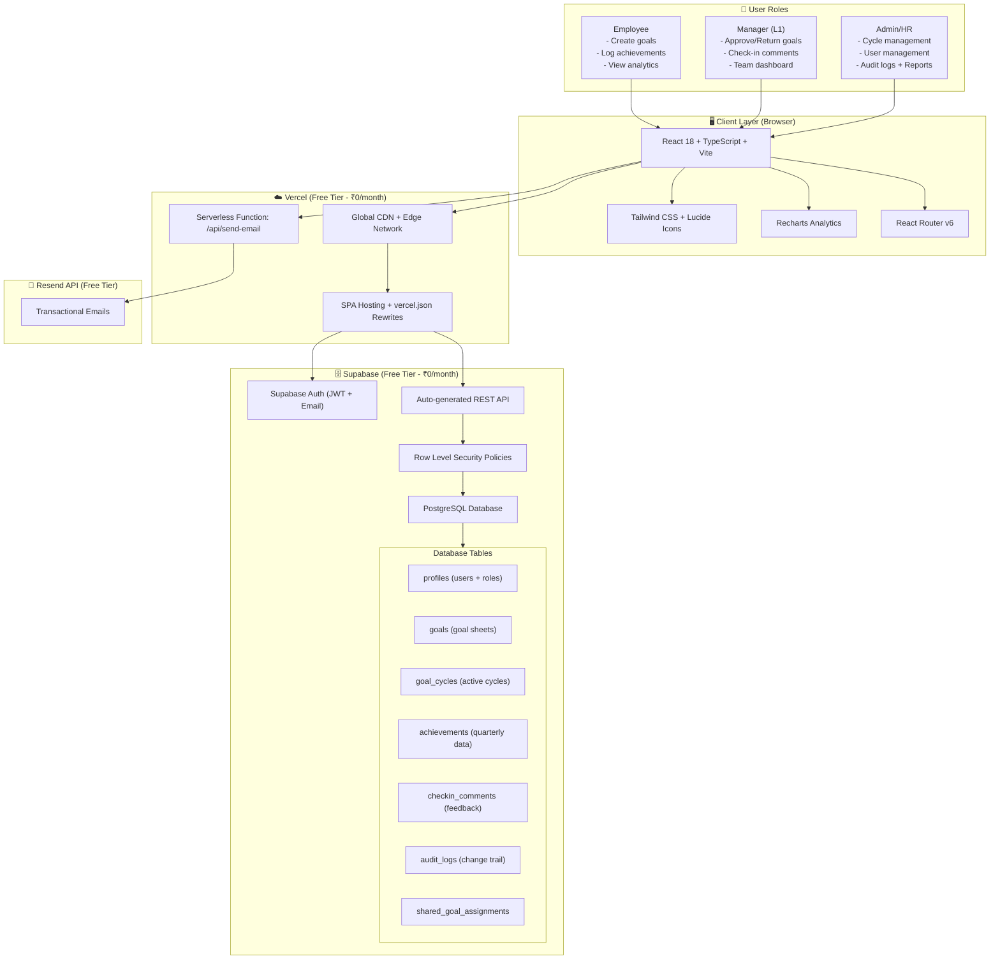

# KaamKaaj Architecture

## Project Links

- **GitHub Repository:** https://github.com/shivangiS04/KaamKaaj
- **Deployed Application:** https://kaam-kaaj-blue.vercel.app/login

## Tech Stack Summary
| Layer | Technology | Cost |
|---|---|---|
| Frontend | React 18 + TypeScript + Vite | Free |
| Styling | Tailwind CSS + Lucide Icons | Free |
| Charts | Recharts | Free |
| Hosting | Vercel Free Tier | ₹0/month |
| Database | Supabase PostgreSQL | ₹0/month |
| Auth | Supabase Auth (JWT) | ₹0/month |
| Email | Resend Free Tier | ₹0/month |
| **Total** | **Full production stack** | **₹0/month** |

## Cost Optimization Strategy
- Vercel free tier: 100GB bandwidth, unlimited deployments
- Supabase free tier: 500MB database, 50,000 monthly active users
- Zero server maintenance — fully managed serverless
- Auto-scaling with no configuration needed
- Total monthly cost scales to ₹0 until 50,000 MAU

## Security Architecture
- Supabase Row Level Security (RLS) on all tables
- JWT-based authentication with automatic token refresh
- Role-based access control (Employee / Manager / Admin)
- Protected routes on frontend via ProtectedRoute component
- API keys stored as environment variables, never exposed to client

## Data Flow
1. User logs in → Supabase Auth issues JWT token
2. Frontend sends JWT with every API request
3. Supabase RLS validates JWT and enforces row-level permissions
4. Employee data isolated — users can only see their own records
5. Manager data scoped to their direct reports only
6. Admin has full access via elevated RLS policies

## Bonus Features Implemented
- Analytics Dashboard (bar chart, pie chart, QoQ line chart)
- Manager Effectiveness Overview
- Escalation Alerts for HR
- Check-in Window Enforcement (Admin controlled)
- Shared Goals across employees
- Complete Audit Trail post goal-lock
- CSV Export for achievement reports
- Skeleton loaders for all pages
- One-click demo login on landing page
