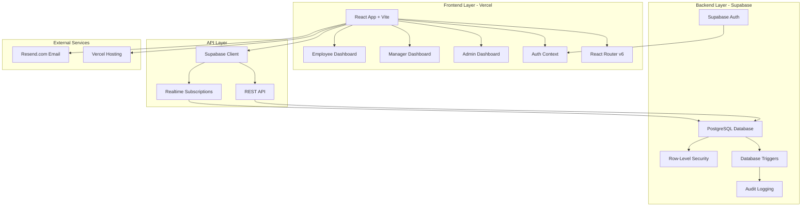

# Goal Setting & Tracking Portal - Architecture Documentation

## System Architecture Overview



## Database Schema

### Entity Relationship Diagram

```
┌─────────────────┐
│   auth.users    │
│  (Supabase)     │
└────────┬────────┘
         │
         │ 1:1
         ▼
┌─────────────────┐         ┌──────────────────┐
│    profiles     │◄────────┤   goal_cycles    │
│                 │  N:1    │                  │
│ • id (PK)       │         │ • id (PK)        │
│ • name          │         │ • year           │
│ • email         │         │ • phase_name     │
│ • role          │         │ • window_open    │
│ • manager_id    │         │ • window_close   │
└────────┬────────┘         │ • is_active      │
         │                  └──────────────────┘
         │ 1:N
         ▼
┌─────────────────┐
│      goals      │
│                 │
│ • id (PK)       │
│ • employee_id   │◄────┐
│ • goal_cycle_id │     │
│ • title         │     │
│ • description   │     │
│ • thrust_area   │     │
│ • uom_type      │     │
│ • target_value  │     │
│ • target_date   │     │
│ • weightage     │     │
│ • status        │     │
│ • is_shared     │     │
│ • is_locked     │     │
└────────┬────────┘     │
         │              │
         │ 1:N          │
         ▼              │
┌─────────────────────┐ │
│ shared_goal_        │ │
│ assignments         │ │
│                     │ │
│ • id (PK)           │ │
│ • source_goal_id    │─┘
│ • assigned_to       │
│ • weightage         │
└──────────┬──────────┘
           │
           │ 1:N
           ▼
┌─────────────────────┐
│   achievements      │
│                     │
│ • id (PK)           │
│ • goal_id           │
│ • quarter           │
│ • actual_value      │
│ • actual_date       │
│ • progress_status   │
│ • score             │
└──────────┬──────────┘
           │
           │ 1:N
           ▼
┌─────────────────────┐
│  checkin_comments   │
│                     │
│ • id (PK)           │
│ • achievement_id    │
│ • manager_id        │
│ • comment           │
│ • created_at        │
└─────────────────────┘

┌─────────────────────┐
│    audit_logs       │
│                     │
│ • id (PK)           │
│ • table_name        │
│ • record_id         │
│ • action            │
│ • changed_by        │
│ • old_data (JSONB)  │
│ • new_data (JSONB)  │
│ • changed_at        │
└─────────────────────┘
```

## Component Architecture

### Frontend Component Hierarchy

```
App
├── AuthProvider (Context)
│   └── Router
│       ├── Login
│       ├── ProtectedRoute (Employee)
│       │   ├── EmployeeDashboard
│       │   ├── GoalCreation
│       │   ├── MyGoals
│       │   └── AchievementInput
│       ├── ProtectedRoute (Manager)
│       │   ├── ManagerDashboard
│       │   ├── TeamGoalReview
│       │   ├── GoalApproval
│       │   └── QuarterlyCheckin
│       └── ProtectedRoute (Admin)
│           ├── AdminDashboard
│           ├── UserManagement
│           ├── CycleManagement
│           ├── GoalUnlock
│           ├── CompletionDashboard
│           ├── AchievementReport
│           └── AuditLogViewer
```

## Data Flow

### Goal Creation Flow

```
Employee Dashboard
    │
    ▼
Goal Creation Form
    │
    ├─► Validate Weightage (100%)
    ├─► Validate Min Weightage (10%)
    ├─► Validate Max Goals (8)
    │
    ▼
Save as Draft / Submit
    │
    ▼
Supabase Client
    │
    ▼
PostgreSQL + RLS
    │
    ├─► Insert into goals table
    ├─► Trigger audit_log
    │
    ▼
Manager Dashboard
    │
    ▼
Goal Approval Workflow
```

### Achievement Input Flow

```
Employee Dashboard
    │
    ▼
Achievement Input Page
    │
    ├─► Check Check-in Window
    ├─► Fetch Approved Goals
    │
    ▼
Input Actual Values
    │
    ├─► Calculate Score (Utils)
    │   ├─► Numeric Min: actual/target * 100
    │   ├─► Numeric Max: target/actual * 100
    │   ├─► Timeline: date comparison
    │   └─► Zero: actual === 0 ? 100 : 0
    │
    ▼
Save Achievements
    │
    ▼
Supabase Client
    │
    ▼
PostgreSQL + RLS
    │
    ├─► Upsert into achievements table
    ├─► Trigger audit_log
    │
    ▼
Manager Check-in Module
```

## Security Architecture

### Row-Level Security (RLS) Policies

```
┌─────────────────────────────────────────────────────────┐
│                    RLS Policy Matrix                     │
├─────────────┬──────────┬──────────┬──────────┬──────────┤
│   Table     │ Employee │ Manager  │  Admin   │  Public  │
├─────────────┼──────────┼──────────┼──────────┼──────────┤
│ profiles    │ Own only │ Team +   │ All      │ None     │
│             │          │ Own      │          │          │
├─────────────┼──────────┼──────────┼──────────┼──────────┤
│ goal_cycles │ Read all │ Read all │ All      │ None     │
├─────────────┼──────────┼──────────┼──────────┼──────────┤
│ goals       │ Own +    │ Team +   │ All      │ None     │
│             │ Shared   │ Own      │          │          │
├─────────────┼──────────┼──────────┼──────────┼──────────┤
│ shared_goal │ Assigned │ Team     │ All      │ None     │
│ assignments │ to self  │          │          │          │
├─────────────┼──────────┼──────────┼──────────┼──────────┤
│ achievements│ Own only │ Team +   │ All      │ None     │
│             │          │ Own      │          │          │
├─────────────┼──────────┼──────────┼──────────┼──────────┤
│ checkin_    │ Own only │ Team     │ All      │ None     │
│ comments    │ (read)   │ (R/W)    │          │          │
├─────────────┼──────────┼──────────┼──────────┼──────────┤
│ audit_logs  │ None     │ None     │ All      │ None     │
└─────────────┴──────────┴──────────┴──────────┴──────────┘
```

### Authentication Flow

```
User Login
    │
    ▼
Supabase Auth
    │
    ├─► Validate Credentials
    ├─► Generate JWT Token
    │
    ▼
Fetch Profile from profiles table
    │
    ├─► Get role
    ├─► Get manager_id
    │
    ▼
Store in Auth Context
    │
    ▼
Route to Role-specific Dashboard
    │
    ├─► Employee → /employee
    ├─► Manager → /manager
    └─► Admin → /admin
```

## API Integration

### Supabase Client Operations

```typescript
// Read Operations
supabase.from('goals').select('*').eq('employee_id', userId)

// Insert Operations
supabase.from('goals').insert({ ...goalData })

// Update Operations
supabase.from('goals').update({ status: 'approved' }).eq('id', goalId)

// Delete Operations
supabase.from('goals').delete().eq('id', goalId)

// Complex Queries with Joins
supabase
  .from('goals')
  .select(`
    *,
    profiles:employee_id (name, email),
    achievements (*)
  `)
  .eq('status', 'submitted')
```

## State Management

### Auth Context Structure

```typescript
interface AuthContextType {
  user: User | null;              // Supabase Auth user
  profile: Profile | null;        // User profile with role
  session: Session | null;        // Auth session
  loading: boolean;               // Loading state
  signIn: (email, password) => Promise<void>;
  signOut: () => Promise<void>;
  refreshProfile: () => Promise<void>;
}
```

## Performance Optimizations

1. **Database Indexes**
   - `idx_goals_employee_id` on goals(employee_id)
   - `idx_goals_status` on goals(status)
   - `idx_achievements_goal_id` on achievements(goal_id)
   - `idx_profiles_manager_id` on profiles(manager_id)

2. **Query Optimization**
   - Use `.select()` to fetch only required columns
   - Implement pagination for large datasets
   - Use `.single()` for single-row queries

3. **Frontend Optimization**
   - React.memo for expensive components
   - Lazy loading for route components
   - Debounced search inputs
   - Optimistic UI updates

## Deployment Architecture

```
┌─────────────────────────────────────────────────────────┐
│                    Production Setup                      │
├─────────────────────────────────────────────────────────┤
│                                                          │
│  GitHub Repository                                       │
│         │                                                │
│         ▼                                                │
│  Vercel (Auto Deploy)                                    │
│         │                                                │
│         ├─► Build: npm run build                         │
│         ├─► Deploy: Static files to CDN                  │
│         └─► Environment Variables:                       │
│             • VITE_SUPABASE_URL                          │
│             • VITE_SUPABASE_ANON_KEY                     │
│                                                          │
│  Supabase (Managed Backend)                              │
│         │                                                │
│         ├─► PostgreSQL Database                          │
│         ├─► Authentication Service                       │
│         ├─► Row-Level Security                           │
│         └─► Realtime Subscriptions                       │
│                                                          │
│  Resend.com (Email Service)                              │
│         │                                                │
│         └─► Transactional Emails                         │
│                                                          │
└─────────────────────────────────────────────────────────┘
```

## Monitoring & Logging

### Audit Log Structure

```json
{
  "table_name": "goals",
  "record_id": "uuid",
  "action": "UPDATE",
  "changed_by": "user_uuid",
  "old_data": {
    "status": "submitted",
    "is_locked": false
  },
  "new_data": {
    "status": "approved",
    "is_locked": true
  },
  "changed_at": "2024-01-15T10:30:00Z"
}
```

### Error Handling Strategy

1. **Frontend Errors**
   - Try-catch blocks for async operations
   - Toast notifications for user feedback
   - Error boundaries for component errors

2. **Backend Errors**
   - RLS policy violations → 403 Forbidden
   - Validation errors → 400 Bad Request
   - Auth errors → 401 Unauthorized

3. **Database Errors**
   - Constraint violations → User-friendly messages
   - Connection errors → Retry logic
   - Transaction rollbacks → Automatic

## Scalability Considerations

1. **Database**
   - Connection pooling via Supabase
   - Read replicas for reporting queries
   - Partitioning for large tables (achievements)

2. **Frontend**
   - CDN distribution via Vercel
   - Code splitting by route
   - Asset optimization (images, fonts)

3. **API**
   - Rate limiting via Supabase
   - Caching for static data (goal_cycles)
   - Batch operations for bulk updates

## Future Enhancements

1. **Phase 2 Features**
   - Mobile app (React Native)
   - Advanced analytics with ML predictions
   - Integration with HR systems (Workday, BambooHR)
   - Multi-language support (i18n)

2. **Technical Improvements**
   - GraphQL API layer
   - Redis caching layer
   - Elasticsearch for advanced search
   - WebSocket for real-time updates

3. **Business Features**
   - 360-degree feedback
   - Competency frameworks
   - Succession planning
   - Performance calibration sessions
